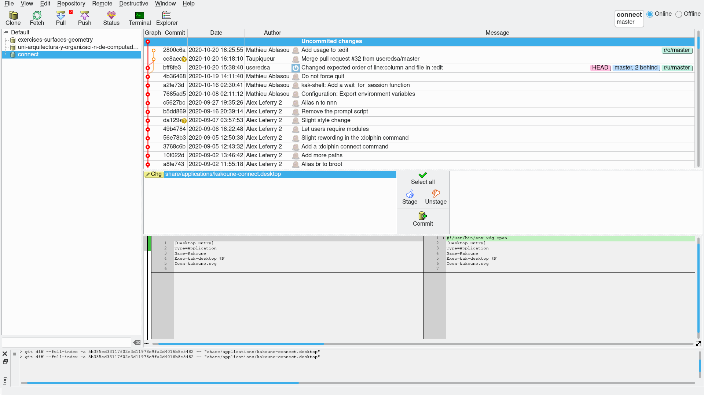
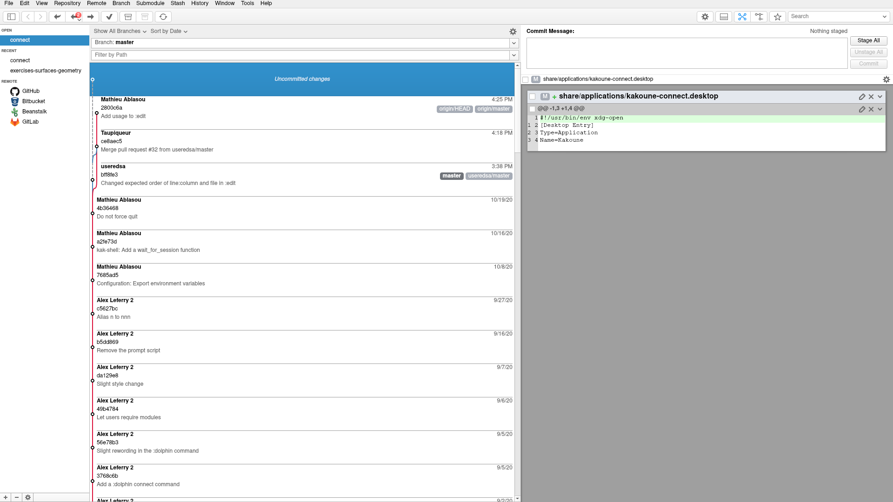
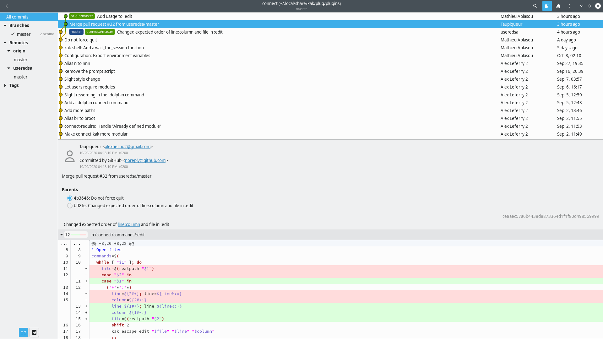
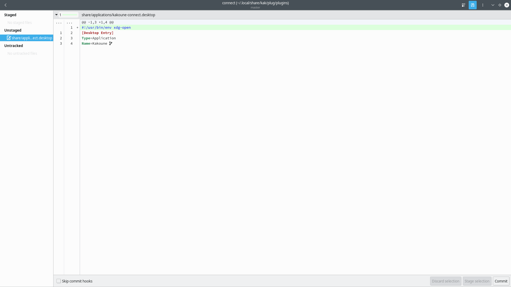

= Listado de interfaces gráficas para Git
:Guitar: https://github.com/soramimi/Guitar[Guitar]
:GitAhead: https://gitahead.github.io/gitahead.com/[GitAhead]
:gitg: https://wiki.gnome.org/Apps/Gitg[gitg]
:GNOME: https://www.gnome.org/

He estado probando varias interfaces gráficas.
Aquí incluyo las que me parecen más interesantes para un principiante.

== {Guitar}

=== Vista previa

* Tiene una interfaz gráfica sencilla que lo muestra todo en la misma pantalla.

=== Mi opinión acerca de lo mejor

* Agrupa las acciones que son potencialmente destructivas bajo una pestaña que
pone `destructive`.

Hablamos de acciones como `git reset --hard`,
que mueve la rama a otro commit, normalmente más antiguo,
descartando los cambios que hubiésemos hecho.

* Tiene un botón `status` que nos muestra la salida que daría `git status` en la terminal.

`git status` es probablemente el comando más útil para utilizar en la terminal
para saber el estado del repositorio.
Tenerlo a mano sin tener que abrir una terminal es muy útil.

* Tiene numeritos que indican cuántos commits nuevos
bajaríamos con un pull o subiríamos con un push.

* Es fácil empezar a utilizarla pero ofrece también funcionalidades avanzadas.

* Utiliza Git por debajo y la salida de los comandos para mostrar la información.

Lo bueno es que podemos activar una ventana log que nos muestra
los comandos que iría ejecutando,
por lo que es muy útil para aprender un poco de los comandos de terminal también(
Nota: algunos de estos comandos asustan un poco porque referencian al commit
actual con un hash, un código, muy largo.
En la terminal no necesitaríamos hacer eso casi nunca.
).

En general, es una aplicación que hace Git visual y sencillo pero al mismo tiempo
haría muy fácil empezar a utilizar la terminal más tarde.

== {GitAhead}

=== Vista previa

* Tiene una interfaz gráfica sencilla que lo muestra todo en la misma pantalla.

=== Mi opinión acerca de lo mejor

* Tiene una interfaz bastante limpia.

* El panel para mostrar los diffs es el mejor
entre todas las aplicaciones de esta lista.

* Tiene numeritos que indican cuántos commits nuevos
bajaríamos con un pull o subiríamos con un push.

* Es fácil empezar a utilizarla pero ofrece también funcionalidades avanzadas.

== {gitg}

=== Vista previa

* Tiene una interfaz gráfica que se integra con el resto del escritorio {GNOME},
y se asimila al resto de sus productos visualmente.
(El escritorio GNOME es conocido por tener aplicaciones sencillas de utilizar.)

* Tiene dos vistas diferentes.
Una para ver la historia del proyecto y hacer operaciones sobre los commits.
Y otra para manejar la staging area y hacer nuevos commits.

//TODO las 2 fotos

=== Mi opinión acerca de lo mejor

* Tiene una interfaz extremadamente limpia. Las pantallas contienen pocos botones.

* Puede escanear tu ordenador en busca de repositorios git.

* Separa de forma visual las ramas de los commits y
de la zona para crear nuevos commits.

* Incluye tan solo la funcionalidad más básica para empezar.

No permite borrar ramas o commits.
Para eso, se espera que un usuario haga un nuevo commit que borre esos cambios.
Esto último puede ser considerado algo positivo o algo negativo.
Por un lado, tener menos funcionalidad hace muy fácil aprender.
Por otro lado, si tras algunos meses de utilizar git queremos
realizar algo más avanzado,
tendremos que utilizar la terminal o sustituir la interfaz gráfica por otra.

* Tiene un menú de preferencias muy sencillo.

//TODO Documentar GitKraken y SourceTree.
// Son muy buenas aplicaciones y funcionan muy bien en varios sistemas operativos.
// GitKraken en todos y SourceTree en Windows y MacOs.
// No obstante, fuerzan a tener cuenta de GitKraken o de Atlassian y admeás,
// GitKraken solo es gratuita con fines no comerciales y SourceTree tengo que leer
// la licencia.

